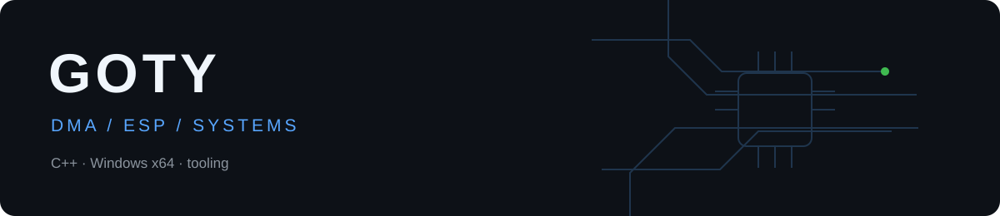

### DMA / ESP / systems tooling

I work with C#, C++, C, Python, Rust and JavaScript, plus HTML and CSS for the web.
My focus here is DMA/ESP projects, memory-reading pipelines and Windows rendering.
This profile is a home for public source snapshots and small tools around that stack.

### Projects

| Project | Focus |
| --- | --- |
| [GOTY ESP · Tarkov](https://github.com/justGoty/goty-esp-dma-tarkov) | C++ source snapshot: DMA reads, player/loot ESP, DirectX Fuser rendering. |
| [DMA Project Watch](https://github.com/justGoty/dma-project-watch) | A lightweight GitHub release tracker for the DMA/ESP ecosystem. |

### What I care about

- Fresh, consistent memory snapshots and measurable diagnostics.
- Clear separation between the read pipeline and rendering.
- Reproducible offline checks; hardware compatibility is a separate test.

Questions and bug reports belong in the relevant repository's issues.
